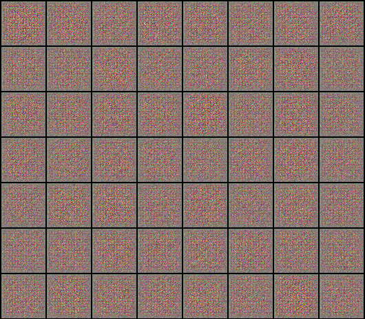

# Neural-Network-Tutorial
With the code found in this repository you can learn how to use PyTorch to create and train a neural network to perform tasks such as:

- Linear regression.
- Image recognition.
- Generate new images such as handwritten numbers or faces.

